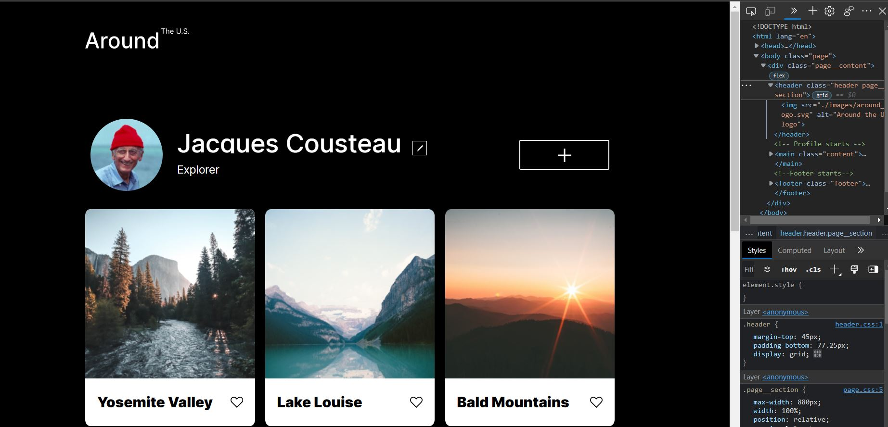

# Project 3: Around The U.S.

### Overview

- Intro
- Technologies
- Images
- Website

**Intro**

This project is made so all the elements are displayed correctly on popular screen sizes. The first stage is creating an image gallery. Within that gallery will be images of different locations that one can visit with the abilty to click on a icon to like it. Also the user will be able to make changes by clicking on the edit icon or the plus icon to add to the site.

**Technoliges**

- [Link to the project on Figma] Will give you the abilty to see the markup of the website. From this the appropriate dimensions can be found out.
- Devtools: Will give you the abilty to see your website at different resolutions. 

**Screenshots**  
 Here are some screenshoots of the site using DevTools

**Website**
This is the link to the final product: url(https://zendar-blackfyre.github.io/se_project_aroundtheus/)
